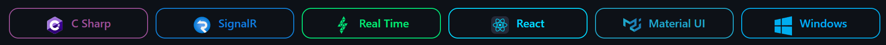
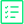

    

 

    

 
 

     <h2 align="center">Description</h2>

    
A web based solution for fully controlling windows computers on your local network.

    
Most notible characteristic is to be as close as possiable to real-time as possible in all features.

 
 

     <h2 align="center">Features</h2>

 
 

<table align="center">
    
<tr>
    <th>          
    </td>
    <th> 
        <h3 align="center">Ready</h3> 
    </td>
</tr>

<tr>
    <td>
        
    </td>
    <td>Live stream of main display</td>
</tr>

<tr>
    <td>
        
    </td>
    <td>Current list of running processes</td>
</tr>

<tr>
    <td>
        
    </td>
    <td>Process update ( Process ends )</td>
</tr>

<tr>
    <td>
        
    </td>
    <td>Terminate a running process</td>
</tr>

<tr>
    <td>
        
    </td>
    <td>Current CPU % usage</td>
</tr>

<tr>
    <td>
        
    </td>
    <td>Current RAM % usage</td>
</tr>

<tr>
    <td>
        
    </td>
    <td>Current GPU % usage</td>
</tr>

</table>

<table align="center">
<tr>
    <th>    
    </th>
    <th> 
        <h3 align="center">Upcoming</h3> 
    </th>
</tr>

<tr>
    <td>
        
    </td>
    <td>Keystroke Logger</td>
</tr>

<tr>
    <td>
        
    </td>
    <td>Control keyboard</td>
</tr>

<tr>
    <td>
        
    </td>
    <td>Control mouse</td>
</tr>

<tr>
    <td>
        
    </td>
    <td>Get live camera feed</td>
</tr>

<tr>
    <td>
        
    </td>
    <td>Toggle features off/on (Saves memory & compute on client)</td>
</tr>

<tr>
    <td>
        
    </td>
    <td>Set resource allocation limits</td>
</tr>

</table>

     <h2 align="center">Beta Demo</h2>

 
 

    
    

